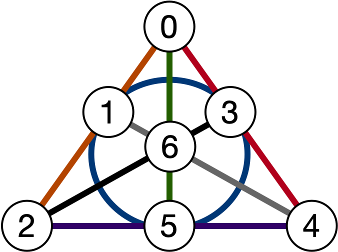
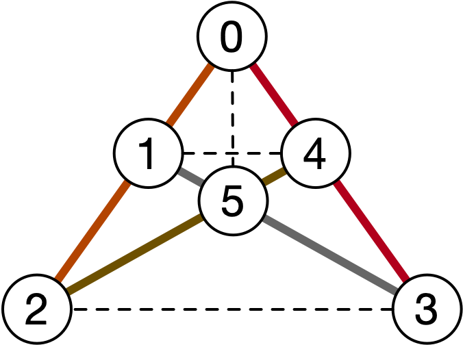

# Fuzzy Designs

## Combinatorial Block Designs

**Article:** [Block Design (Wikipedia).](https://en.wikipedia.org/wiki/Block_design#General_balanced_designs_(t-designs))

A $t-(v, k, \lambda)$ combinatorial block design is a pair $(V, B)$:

* $t < k < v$ and $\lambda$ are all positive integers.
* $V$, the set of _points_ of the design, is a set of size $v$, typically taken to be $\{0, \ldots, v-1\}$.
* Let $D = \lambda \times {V \choose k}$ be a (multi)set consisting of all the $k$-sets of $V$ (each repeated $\lambda$ times).
* $B \subset D$, the (multi)set of _blocks_ of the design, is a (multi)set such that for all $T \in D$, we have:

$$|\left{ K \in B \, | \, T \in K \right}| = \lambda$$

A necessary condition for the existence of a $t-(v, k, \lambda)$ design is that the number of blocks:

$$b = \lambda \frac{{v \choose t}}{{k \choose t}}$$

be an integer: however, this condition is not sufficient.

**Notation:** If $\{v_0, v_1, \ldots, v_{k-1}\} \in D$, if we can do so without ambiguity, we write it shorthand as:

$$v_0 v_1 \ldots v_{k-1}.$$

**Notation:** Typically, a design whose parameters are given is represented simply by its list of blocks, with $V$ taken
to be $\{0, \ldots, v-1\}$ as stated above.

A famous example of a $2-(7, 3, 1)$ design is the _Fano plane_, the smallest finite projective geometry. It is unique up
to isomorphism and can be written as:

$$\{012, 034, 056, 135, 146, 236, 245\}$$

Graphically, this can be represented via the following diagram, where the blocks are represented by the lines
of different colours.

## Non-Existence of Combinatorial Block Designs

A well-known theorem in combinatorial design theory is that a $2-(v,3,1)$ design (also called a
_Steiner triple system_ of order $v$, denoted STS(v)) exists if and only if:

$$v \equiv 1, 3 \pmod{6}.$$

The Fano plane as shown above  is the unique STS(7) up to isomorphism.

An example of a design where the number of blocks is an integer but no such design exists can be seen with the
nonexistence of an STS(6). The formula for the number of blocks yields:

$$b = \frac{{6 \choose 2}}{{3 \choose 2}} = \frac{15}{3} = 5.$$

This is an integer, but when we try to construct such a design, we must necessarily miss three pairs. For example:

$$B = \{012, 034, 135, 245\}$$

is the maximal set of triples we can construct on six points (uniquely up to isomorphism).
We are missing coverage of the pairs:

$$\{05, 14, 23\}.$$

The graph comprising the missing pairs form what is called a _leave graph_.

Given that an STS(v) is the decomposition of the complete graph $K_v$ into 3-cliques
(which comprise the edges), it is simple to see there is no way to choose 3-cliques: any vertex $v$ in $K_6$
has degree 5, and each 3-clique it appears in must contain two edges adjacent to it.
Thus, it can appear in at most two 3-cliques, leaving one edge uncovered, as in the diagram above.

Thus, there is no way to arrange the points into triples to obtain the desired system.

## Fuzzy Sets

**Article:** [Fuzzy Set (Wikipedia).](https://en.wikipedia.org/wiki/Fuzzy_set)

A _fuzzy (multi)set_ is a set where the members have a certain degree of membership.

It is represented by a pair $(S, m)$ where $S$ is a classical set, and $m: S \rightarrow [0,1]$ indicating the degree
to which an element $s \in S$ is a member of $S$.

There are many notations to write fuzzy sets. For the purposes of this project, we represent them by:

$$(S, m) = \{m(s) * s\, \middle| \, s \in S\}$$

If $m(s) = c$ for all $s \in S$, then we simply write:

$$(S, c) = c * S.$$

## Fuzzy Combinatorial Block Designs

In this repository, we examine designs where we allow the set of blocks to be a fuzzy set. In the case where we refer
to a fuzzy block set, we denote the set $B_f$.

### Fuzzy STS(6): 2-uniformly fuzzy block sets

In the example above where we try to construct an STS(6), if we allow for fuzzy blocks, we can indeed
construct a fuzzy STS(6). Note that $b = 5$ is an integer in this case. 

Let us allow _half blocks_ to be taken. This equates to $K_6$ being decomposed into 3-cliques where every edge
appears **twice**. In this case:

$$B_f = \frac{1}{2} * \{012, 013, 024, 035, 045, 125, 134, 145, 234, 235\}.$$

For any pair, we can see that it appears in exactly two half-blocks: thus, it is half-covered twice,
leading to a complete coverage. We call this a 2-uniformly fuzzy block set.

### Fuzzy STS(5): 3-uniformly fuzzy block sets

Furthermore, we remove the requirement that the size of the block set, namely $b$, be an integer.

Then we can examine cases such as STS(5), where we have:

$$b = \frac{{5 \choose 2}}{{3 \choose 2}} = \frac{10}{3}.$$

We can take the following fuzzy block set:

$$B_f = \frac{1}{3} * \{012, 013, 014, 023, 024, 034, 123, 124, 134, 234\}.$$

We can see that every pair appears in three triples. Indeed, all the possible triples are listed, and thus every pair
appears in precisely three triples; thus, it is always the case that for an STS(v), we always have a fuzzy block $B$
with constant $\frac{1}{3}$, which we call a 3-uniformly fuzzy block set, namely:

$$B_f = \frac{1}{3} {V \choose 3}.$$

### Fuzzy uniformly block sets in STS

This leads to the question:

**Question:** For STS(v) where $v \not\equiv 1, 3 \pmod{6}$, what is the smallest uniformly fuzzy block set that we
require to ensure perfect coverage of all pairs? (By smallest, we mean the base set contains the fewest blocks, which
corresponds to a smaller value of $c$ over the uniformly fuzzy block.)

In the case of STS(v), we can always have a uniformly fuzzy set with constant function either:
* 1 (in the case $v = 1, 3 \pmod{6}$) over $b$ blocks;
* 2 (hypothesis: when $b$ is an integer) over $2 * b$ blocks; or
* 3 over $3 * b$ blocks for all cases.

TODO: Attempt to characterize the uniformity.

### Fuzzy STS(8)

If we look at STS(8), however, where $b = \frac{28}{3}$, the situation changes:
we cannot get a 2-uniformly fuzzy block set, but we can do better than a 3-uniformly fuzzy
block set which would require all 56 blocks to be included in the fuzzy block set.

We can cover the pairs with the following block set, which we partition according to the function $m(B_f)$:

TODO: Fill in.

## Usage

The `fuzzy_designs.py` script requires parameters `t`, `v`, `k`, and `lambda`, and then formulates the problem as a
minimization problem over the set of all blocks using Google's OR tools linear program interface over the GLOP solver.

